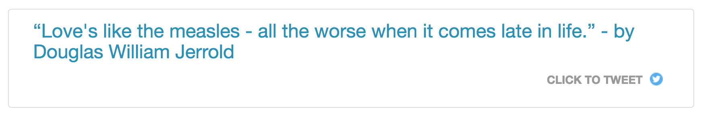

# hexo-tag-tweetable-quote for [Hexo](https://hexo.io)

Click to Tweet / Tweetable quotes for [Hexo](https://hexo.io)

[](https://www.npmjs.com/package/hexo-tag-tweetable-quote)
[](https://snyk.io/test/github/iamchathu/hexo-tag-tweetable-quote)
[](https://travis-ci.org/iamchathu/hexo-tag-tweetable-quote)
[](https://raw.githubusercontent.com/iamchathu/hexo-tag-tweetable-quote/master/LICENSE)
[](https://twitter.com/intent/tweet?text=Wow:&url=%5Bobject%20Object%5D)

# About

This is a [Hexo](https://hexo.io) tag plugin for including a tweetable quote into your pages/posts. Example of what they can look like is attached below:



Inspired by [RisingStack Blog](https://blog.risingstack.com/node-hero-node-js-authentication-passport-js/).

# Installation

The same as other Hexo plugins its simply:

```npm i -S hexo-tag-tweetable-quote```

In your Hexo project root.


# Usage

## Options
You can configure this plugin in `_config.yml`.

```yaml
tweetableQuote:
  quote_font_color : '#258fb8'
  quote_font_size  : '1.7em'
  link_font_color  : '#6e7b8d'
  link_font_size   : '1.0em'
  via_twitter_account : 'iamchathu'
  related_twitter_accounts : 'iamchathu'
```

- **quote_font_color** - Font color of quote. Defaults to `#258fb8`.
- **quote_font_size** - Font size of the quote. Defaults to `1.7em`.
- **link_font_color** - Click to tweet link font color. Defaults to `#6e7b8d`.
- **link_font_size** - Click to tweet link font size. Defaults to `1.0em`.

The full tag format is as follows:

```

```


# Example in the Wild

I normally add Tweetable quote to my blog posts.

You can check one of them at [Chathu's Visionaries](http://chathu.me/about/)

## Tested themes

* [landscape](https://github.com/hexojs/hexo-theme-landscape)

* [icarus](https://github.com/ppoffice/hexo-theme-icarus)

## Todo

- [ ] Add Post URL to tweet [(Issue : Accessing Post/Page URL inside plugin)](https://github.com/hexojs/hexo/issues/2305)
